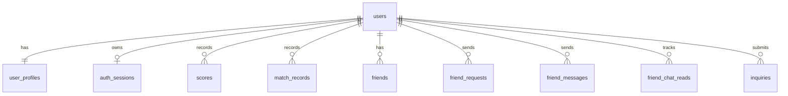

# PlayFlow MySQLデータ設計書（v0.1）

最終更新: 2026-07-29
作成者: GitHub Copilot
状態: Draft
対象: `apps/api`（NestJS API）

---

## 1. 目的

本書は、PlayFlowのクラウド保存機能をMySQLで運用するためのデータ設計を定義する。
現行実装（SQLite + JSONファイル）で永続化しているデータを、MySQLへ段階移行できる構成を示す。

---

## 2. 設計方針

- クリック/タップ中心の体験を阻害しないため、読み取り頻度の高いデータにインデックスを付与する。
- 対戦中の瞬間状態（WebSocket接続情報など）はDB保存しない。
- API契約を優先し、既存エンドポイントと同じ責務でテーブルを分割する。
- 監査性のため、時系列で意味を持つデータは `created_at` / `updated_at` を保持する。

---

## 3. 保存対象の分類

### 3.1 必須（Phase 1）

- 認証ユーザー
- セッション
- プロフィール
- スコア
- 対戦履歴

### 3.2 準必須（Phase 2）

- フレンド関係
- フレンド申請
- フレンドチャット
- 既読管理
- お問い合わせ

### 3.3 保存不要（DB対象外）

- ルーム内の一時状態（接続中ソケット、投票途中状態）
- 画面表示用の一時UI状態（開閉パネル、選択中タブ）

---

## 4. 論理データモデル



---

## 5. テーブル定義（推奨）

### 5.1 users

用途:
- 認証主体（ログインIDとパスワードハッシュ）

主なカラム:
- `user_id` VARCHAR(24) PK
- `pass_hash_bcrypt` VARCHAR(255) NOT NULL
- `created_at` BIGINT NOT NULL
- `updated_at` BIGINT NOT NULL

備考:
- 旧移行用 `pass_salt_hex`, `pass_hash_hex` は移行完了後に廃止可能。

### 5.2 user_profiles

用途:
- ゲーム内進行と表示プロフィール

主なカラム:
- `user_id` VARCHAR(24) PK, FK -> users.user_id
- `player_name` VARCHAR(18) NOT NULL
- `profile_bio` VARCHAR(180) NOT NULL DEFAULT ''
- `player_avatar` MEDIUMTEXT NOT NULL
- `bank_coins` INT NOT NULL DEFAULT 0
- `pity_counter` INT NOT NULL DEFAULT 0
- `selected_skin` VARCHAR(64) NOT NULL DEFAULT 'classic'
- `unlocked_skins_json` JSON NOT NULL
- `match_stats_json` JSON NOT NULL
- `fit_puzzle_progress_json` JSON NOT NULL
- `created_at` BIGINT NOT NULL
- `updated_at` BIGINT NOT NULL

備考:
- 現行の `profile_json` を段階的に正規化するため、初期は JSON 併用が現実的。

### 5.3 auth_sessions

用途:
- 同時ログイン制御、セッション有効期限管理

主なカラム:
- `session_id` CHAR(36) PK
- `user_id` VARCHAR(24) NOT NULL UNIQUE, FK -> users.user_id
- `created_at` BIGINT NOT NULL
- `last_seen_at` BIGINT NOT NULL

インデックス:
- `idx_auth_sessions_last_seen(last_seen_at DESC)`

### 5.4 scores

用途:
- ゲーム別スコア保存・最新取得

主なカラム:
- `id` BIGINT PK AUTO_INCREMENT
- `user_id` VARCHAR(24) NULL, FK -> users.user_id
- `player_name` VARCHAR(18) NOT NULL
- `game` VARCHAR(24) NULL
- `score` INT NOT NULL
- `created_at` BIGINT NOT NULL

インデックス:
- `idx_scores_created(created_at DESC)`
- `idx_scores_game_created(game, created_at DESC)`

### 5.5 match_records

用途:
- 対戦履歴、直近戦績表示、戦績集計の根拠データ

主なカラム:
- `id` BIGINT PK AUTO_INCREMENT
- `user_id` VARCHAR(24) NOT NULL, FK -> users.user_id
- `game` VARCHAR(24) NOT NULL
- `result` ENUM('win','lose','draw') NOT NULL
- `room_code` VARCHAR(6) NOT NULL DEFAULT ''
- `opponent` VARCHAR(18) NOT NULL DEFAULT 'Player'
- `played_at` BIGINT NOT NULL

インデックス:
- `idx_match_records_user_time(user_id, played_at DESC)`
- `idx_match_records_game_time(game, played_at DESC)`

### 5.6 friends

用途:
- フレンド関係（双方向は2行で保持）

主なカラム:
- `user_id` VARCHAR(24) NOT NULL, FK -> users.user_id
- `friend_user_id` VARCHAR(24) NOT NULL, FK -> users.user_id
- `created_at` BIGINT NOT NULL
- PK(`user_id`, `friend_user_id`)

### 5.7 friend_requests

用途:
- 申請中のフレンド関係

主なカラム:
- `requester_user_id` VARCHAR(24) NOT NULL, FK -> users.user_id
- `target_user_id` VARCHAR(24) NOT NULL, FK -> users.user_id
- `created_at` BIGINT NOT NULL
- PK(`requester_user_id`, `target_user_id`)

インデックス:
- `idx_friend_requests_target(target_user_id, created_at DESC)`

### 5.8 friend_messages

用途:
- フレンド間チャット履歴

主なカラム:
- `id` BIGINT PK AUTO_INCREMENT
- `sender_user_id` VARCHAR(24) NOT NULL, FK -> users.user_id
- `receiver_user_id` VARCHAR(24) NOT NULL, FK -> users.user_id
- `message` VARCHAR(400) NOT NULL
- `created_at` BIGINT NOT NULL

インデックス:
- `idx_friend_messages_pair_time(sender_user_id, receiver_user_id, created_at DESC)`

### 5.9 friend_chat_reads

用途:
- 既読位置管理

主なカラム:
- `user_id` VARCHAR(24) NOT NULL, FK -> users.user_id
- `friend_user_id` VARCHAR(24) NOT NULL, FK -> users.user_id
- `last_read_message_id` BIGINT NOT NULL
- `updated_at` BIGINT NOT NULL
- PK(`user_id`, `friend_user_id`)

### 5.10 inquiries

用途:
- 問い合わせ保存、管理画面表示、重複判定補助

主なカラム:
- `id` BIGINT PK AUTO_INCREMENT
- `user_id` VARCHAR(24) NULL, FK -> users.user_id
- `name` VARCHAR(36) NOT NULL
- `message` VARCHAR(200) NOT NULL
- `url` VARCHAR(240) NOT NULL DEFAULT ''
- `lang` VARCHAR(2) NOT NULL
- `submitted_at` BIGINT NOT NULL

インデックス:
- `idx_inquiries_submitted(submitted_at DESC)`
- `idx_inquiries_user_time(user_id, submitted_at DESC)`

---

## 6. APIと保存先の対応

- `POST /api/auth/register`: users, user_profiles, auth_sessions
- `POST /api/auth/login`: auth_sessions（発行/更新）
- `POST /api/auth/logout`: auth_sessions（削除）
- `POST /api/profile/load`: user_profiles
- `POST /api/profile/save`: user_profiles
- `POST /api/match/record`: match_records, user_profiles（match_stats更新）
- `POST /scores`: scores
- `POST /api/friends/*`: friends, friend_requests
- `POST /api/friends/chat/*`: friend_messages, friend_chat_reads
- `POST /api/inquiry/*`: inquiries

---

## 7. Prisma移行方針

現状:
- Prismaスキーマは Phase 1 + Phase 2 の保存モデル定義まで拡張済み。
- マイグレーションSQLはオフライン生成済み（DB接続不要）。
- 生成先: `apps/api/prisma/migrations/20260729155106_phase1_mysql_foundation/migration.sql`

移行順序（推奨）:
1. `users`, `user_profiles`, `auth_sessions` をPrismaモデル化
2. `match_records`, `scores` をPrismaモデル化
3. `friends` 系をPrismaモデル化
4. `inquiries` をPrismaモデル化
5. `profile_json` 依存処理を段階的に削減

---

## 8. 運用ルール

- セッションTTLは `last_seen_at` を基準に失効管理する。
- 対戦履歴・スコアは削除しない前提とし、将来的にアーカイブポリシーを検討する。
- チャットは肥大化しやすいため、保持期間（例: 180日）を定義して定期削除する。

---

## 9. 最小DDLサンプル（Phase 1）

```sql
CREATE TABLE users (
  user_id VARCHAR(24) PRIMARY KEY,
  pass_hash_bcrypt VARCHAR(255) NOT NULL,
  created_at BIGINT NOT NULL,
  updated_at BIGINT NOT NULL
);

CREATE TABLE user_profiles (
  user_id VARCHAR(24) PRIMARY KEY,
  player_name VARCHAR(18) NOT NULL,
  profile_bio VARCHAR(180) NOT NULL DEFAULT '',
  player_avatar MEDIUMTEXT NOT NULL,
  bank_coins INT NOT NULL DEFAULT 0,
  pity_counter INT NOT NULL DEFAULT 0,
  selected_skin VARCHAR(64) NOT NULL DEFAULT 'classic',
  unlocked_skins_json JSON NOT NULL,
  match_stats_json JSON NOT NULL,
  fit_puzzle_progress_json JSON NOT NULL,
  created_at BIGINT NOT NULL,
  updated_at BIGINT NOT NULL,
  CONSTRAINT fk_profiles_user FOREIGN KEY (user_id) REFERENCES users(user_id)
);

CREATE TABLE auth_sessions (
  session_id CHAR(36) PRIMARY KEY,
  user_id VARCHAR(24) NOT NULL UNIQUE,
  created_at BIGINT NOT NULL,
  last_seen_at BIGINT NOT NULL,
  CONSTRAINT fk_sessions_user FOREIGN KEY (user_id) REFERENCES users(user_id)
);

CREATE INDEX idx_auth_sessions_last_seen ON auth_sessions(last_seen_at);

CREATE TABLE scores (
  id BIGINT PRIMARY KEY AUTO_INCREMENT,
  user_id VARCHAR(24) NULL,
  player_name VARCHAR(18) NOT NULL,
  game VARCHAR(24) NULL,
  score INT NOT NULL,
  created_at BIGINT NOT NULL,
  CONSTRAINT fk_scores_user FOREIGN KEY (user_id) REFERENCES users(user_id)
);

CREATE INDEX idx_scores_created ON scores(created_at);
CREATE INDEX idx_scores_game_created ON scores(game, created_at);

CREATE TABLE match_records (
  id BIGINT PRIMARY KEY AUTO_INCREMENT,
  user_id VARCHAR(24) NOT NULL,
  game VARCHAR(24) NOT NULL,
  result ENUM('win','lose','draw') NOT NULL,
  room_code VARCHAR(6) NOT NULL DEFAULT '',
  opponent VARCHAR(18) NOT NULL DEFAULT 'Player',
  played_at BIGINT NOT NULL,
  CONSTRAINT fk_match_user FOREIGN KEY (user_id) REFERENCES users(user_id)
);

CREATE INDEX idx_match_records_user_time ON match_records(user_id, played_at);
CREATE INDEX idx_match_records_game_time ON match_records(game, played_at);
```

---

## 10. 未決事項

- `user_profiles` を完全正規化するか、JSON中心で維持するか。
- `scores` の所有者を `player_name` 主体のまま維持するか、`user_id` 必須に寄せるか。
- 問い合わせの本文最大長（現行200文字）を今後拡張するか。

---

## 11. 実行メモ

- ローカルDB未起動時に `prisma migrate dev` は失敗するため、先に MySQL を起動する。
- 既存の `Score` テーブル（旧初期migration由来）から `scores` へデータ移送する場合は、運用手順書を参照する。
